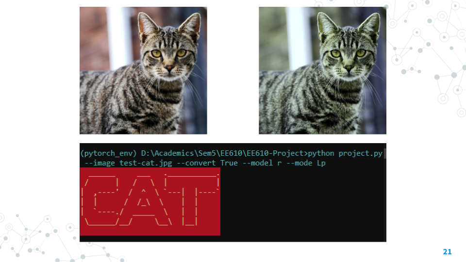

# Does processing in Canine Vision Spectrum retain performance

One  of  the  most  fundamental  applications  in  the  field  of computer  vision  is  image  classification. Since the advent of deep learning techniques, it has been a norm to resort to RGB color space for processing and forward implementations. In this paper, we aim to find out how processing in the canine vision spectrum affects image classification models considering animals view the world differently than humans and might be able to perceive notions and surrounding objects in a more enhanced/restricted way. Specifically, we benchmark our dataset on various models.

Report: Report.pdf

Video Link: https://youtu.be/HO7483F-RbA

Slides: Slides.pdf

## Installation

#### First clone the repository using

```http
  git clone https://github.com/EeshaanJain/EE610-Project
```
#### Now to install the required python packages

```http
  pip install -r requirements.txt
```

## Usage
The file `project.py` can be used to run the inference of your image on any of the models using the canine spectrum. Running 
```bash
python project.py --help 
```
gives
```
usage: EE 610 Project [-h] [--image i] [--convert c] [--model m] [--mode md]

optional arguments:
  -h, --help   show this help message and exit
  --image i    Takes in path to input image file
  --convert c  Converts image to canine vision space (default is True)
  --model m    Enter either of
                       [1] d   : DenseNet
                       [2] r   : ResNet
                       [3] e   : EfficientNet
  --mode md    Choose if you want the Lp mode or Sp mode. Default is Lp
```
1. The image parameter is used to take the input path of the image
2. The convert parameter is used to convert the human spectrum image to the canine spectrum image. It is by default True, since usually we don't have access to such images. But if the image is already in the canine spectrum, set it to False.
3. The model parameter is used to choose which model you want to test the image on. By default it is set to DenseNet i.e 'd'
4. The mode parameter allows you to either choose the high parameter mode, or the low parameter mode. By default it is set to Lp, but choose Sp if you want low parameter mode.

An example test case is:
```bash
python project.py --image test-cat.jpg --convert True --model r --mode Lp 
```

This gives the output as shown. (Note that the image on top-left is the original one, and one on the top-right is the canine vision one. Also, the canine vision image is stored in the temp directory created.)


## Directory structure
- 📂 __EE610\-Project__
   - 📄 [DenseNet\-LMS\-less.pth](DenseNet-LMS-less.pth)
   - 📄 [DenseNet\-LMS.pth](DenseNet-LMS.pth)
   - 📄 [DenseNet\-RGB\-less.pth](DenseNet-RGB-less.pth)
   - 📄 [DenseNet\-RGB.pth](DenseNet-RGB.pth)
   - 📄 [EfficientNet\-LMS\-less.pth](EfficientNet-LMS-less.pth)
   - 📄 [EfficientNet\-LMS.pth](EfficientNet-LMS.pth)
   - 📄 [EfficientNet\-RGB\-less.pth](EfficientNet-RGB-less.pth)
   - 📄 [EfficientNet\-RGB.log](EfficientNet-RGB.log)
   - 📄 [EfficientNet\-RGB.pth](EfficientNet-RGB.pth)
   - 📄 [README.md](README.md)
   - 📄 [Report.pdf](Report.pdf)
   - 📄 [Resnet\-LMS\-less.pth](Resnet-LMS-less.pth)
   - 📄 [Resnet\-LMS.pth](Resnet-LMS.pth)
   - 📄 [Resnet\-RGB\-less.pth](Resnet-RGB-less.pth)
   - 📄 [Resnet\-RGB.pth](Resnet-RGB.pth)
   - 📄 [Slides.pdf](Slides.pdf)
   - 📄 [dataloader.py](dataloader.py)
   - 📄 [densenet.py](densenet.py)
   - 📄 [effnet.py](effnet.py)
   - 📄 [env.bat](env.bat)
   - 📄 [example.png](example.png)
   - 📄 [extracting\_data.py](extracting_data.py)
   - 📄 [help.txt](help.txt)
   - 📄 [image\_converter.py](image_converter.py)
   - 📂 __models__
     - 📂 __densenet__
       - 📄 [DenseNet\-LMS\-less.log](models/densenet/DenseNet-LMS-less.log)
       - 📄 [DenseNet\-LMS\-less.png](models/densenet/DenseNet-LMS-less.png)
       - 📄 [DenseNet\-LMS.log](models/densenet/DenseNet-LMS.log)
       - 📄 [DenseNet\-LMS.png](models/densenet/DenseNet-LMS.png)
       - 📄 [DenseNet\-RGB\-less.log](models/densenet/DenseNet-RGB-less.log)
       - 📄 [DenseNet\-RGB\-less.png](models/densenet/DenseNet-RGB-less.png)
       - 📄 [DenseNet\-RGB.log](models/densenet/DenseNet-RGB.log)
       - 📄 [DenseNet\-RGB.png](models/densenet/DenseNet-RGB.png)
     - 📂 __effnet__
       - 📄 [EfficientNet\-LMS\-less.log](models/effnet/EfficientNet-LMS-less.log)
       - 📄 [EfficientNet\-LMS\-less.png](models/effnet/EfficientNet-LMS-less.png)
       - 📄 [EfficientNet\-LMS.log](models/effnet/EfficientNet-LMS.log)
       - 📄 [EfficientNet\-LMS.png](models/effnet/EfficientNet-LMS.png)
       - 📄 [EfficientNet\-RGB\-less.log](models/effnet/EfficientNet-RGB-less.log)
       - 📄 [EfficientNet\-RGB\-less.png](models/effnet/EfficientNet-RGB-less.png)
       - 📄 [EfficientNet\-RGB.png](models/effnet/EfficientNet-RGB.png)
     - 📂 __resnet__
       - 📄 [Resnet\-LMS\-less.log](models/resnet/Resnet-LMS-less.log)
       - 📄 [Resnet\-LMS\-less.png](models/resnet/Resnet-LMS-less.png)
       - 📄 [Resnet\-LMS.log](models/resnet/Resnet-LMS.log)
       - 📄 [Resnet\-LMS.png](models/resnet/Resnet-LMS.png)
       - 📄 [Resnet\-RGB\-less.log](models/resnet/Resnet-RGB-less.log)
       - 📄 [Resnet\-RGB\-less.png](models/resnet/Resnet-RGB-less.png)
       - 📄 [Resnet\-RGB.log](models/resnet/Resnet-RGB.log)
       - 📄 [Resnet\-RGB.png](models/resnet/Resnet-RGB.png)
   - 📄 [old.txt](old.txt)
   - 📄 [project.py](project.py)
   - 📄 [requirements.txt](requirements.txt)
   - 📄 [resnet.py](resnet.py)
   - 📄 [runner.py](runner.py)
   - 📄 [test\-cat.jpg](test-cat.jpg)
   - 📄 [test\-dog.jpg](test-dog.jpg)
   - 📄 [tree.md](tree.md)
   - 📄 [tree.py](tree.py)
   - 📄 [tree.txt](tree.txt)

        
## Authors

- Aaryan Gupta
- Eeshaan Jain
- Vipin Singh
